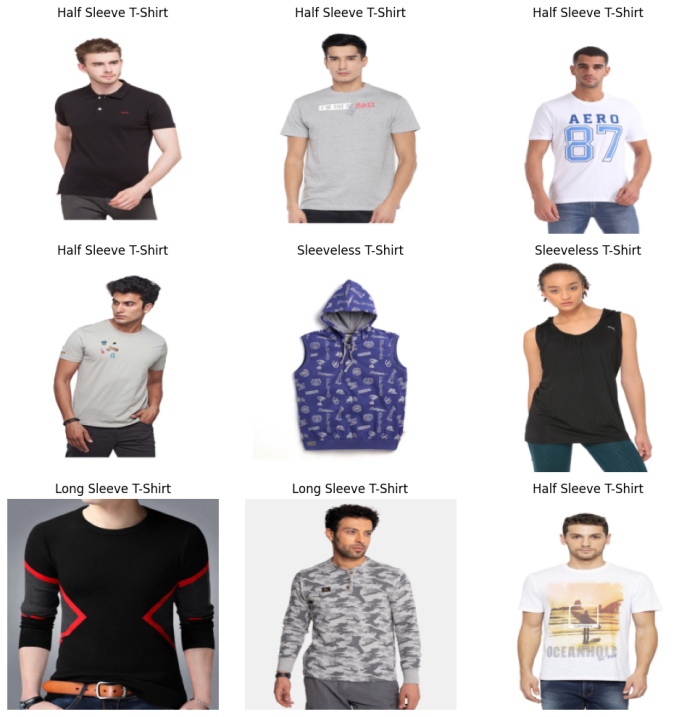
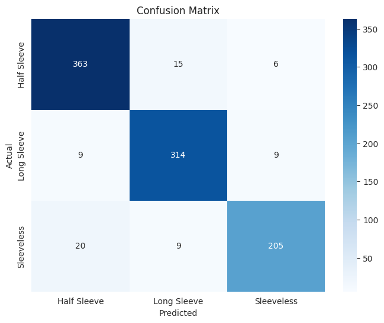

<h1 align="center">T-Shirt Sleeve Classification using CNN</h1>

<h4 align="center">A beginner's approach to deep learning with PyTorch</h4>

 

<h2>Table of Contents</h2>

- [Overview](#overview)
- [Dataset](#dataset)
- [Model](#model)
- [Result](#result)

<h2>Overview</h2>

This project is a beginner's approach to deep learning with PyTorch - so nothing too fancy like transfer learning 😐, regularization 😑 or pre-trained models 🙁. The project aims to classify the sleeves of T-shirts into three categories: full sleeve, half sleeve, and sleeveless. 

<h2>Dataset</h2>

The dataset I used was obtained from <a href="https://www.kaggle.com/datasets/vikram92/classify-sleeves-with-tshirt-images" target="_blank">Kaggle</a>.

It is categorized in 3 classes, each representing a different type of sleeve:

- Full Sleeve: 2118 images
- Half Sleeve: 2670 images
- Sleeveless: 1537 images

<h2>Model</h2>

The model used in this project consists of three convolutional blocks, each containing two convolutional layers followed by ReLU activation and max pooling. The details of this architecture can be found in the <a href="https://github.com/Oyebamiji-Micheal/T-Shirt-Sleeve-Classification-using-Convolutional-Neural-Network/blob/main/t-shirt-sleeve-classification-using-cnns.ipynb" target="_blank">notebook</a>. 

<h2>Result</h2>

After training the model, I evaluated its performance on the test set. The model achieved 93% accuracy and 93% F1-score on the test set, which is hmmm somehow impressive.

However, the model does have a hard time differentiating between half sleeve and sleeveless cloths. Not surprising though. What I will try to do next is use some regularization techniques and maybe a pre-trained model.

See you in the next one 🙂
